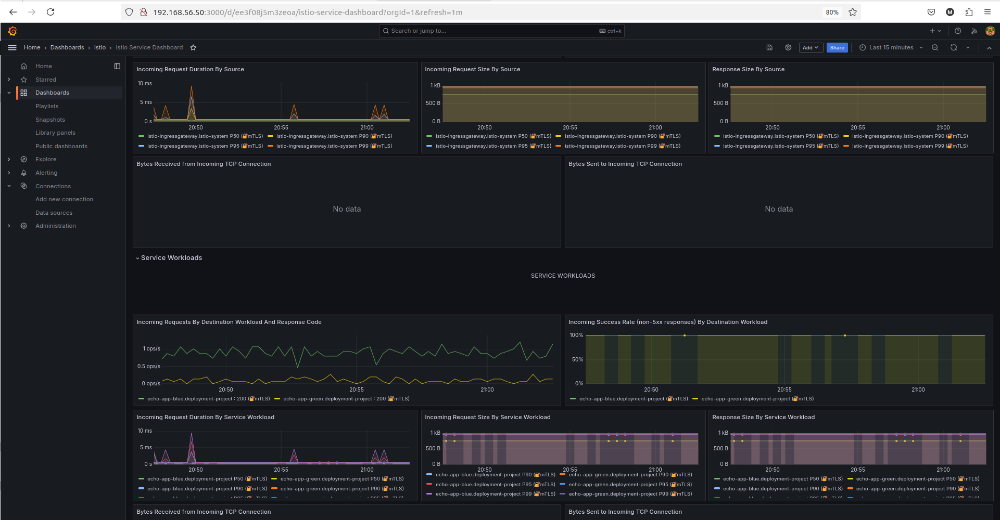

# k8s-istio-blue-green-canary-monitoring

### Prerequisites

- Kubectl Version: 1.27.3
- Kubernetes Cluster Setup - KIND cluster is used here on Vagrant
  
  Kubernetes Version: 1.27.3
- Istioctl  Version: 1.23
  
- Istio Setup

  Istio Version: 1.23  
    
#### Version Compatibility Notes

**kubectl and Kubernetes Cluster:**

Ensure that the kubectl version is compatible with the Kubernetes cluster version. The recommended compatibility range is typically +/- one minor version of the cluster version to avoid unexpected issues.

**istioctl and Istio:**

The istioctl version should match the installed Istio version to ensure compatibility and access to the latest features and configurations for that specific version.

**Kubernetes and Istio:**

Verify that the Istio version you plan to install is compatible with the Kubernetes version of your cluster. Consult the Istio release documentation, as each Istio version supports a specific range of Kubernetes versions

https://istio.io/latest/docs/releases/supported-releases/


---
### Step 1: Install Prometheus, Grafana and Kiali (For Monitoring)

1. **Download ISTIO Version 1.23.**  
   And install Prometheus and Grafana
   
- Prometheus collects metrics.
- Grafana visualizes historical and live data, often for  dashboarding and trend analysis.
- Kiali visualizes real-time traffic flows and dependencies specific to Istio, making it the most direct tool for understanding traffic routing and service dependencies in the mesh. 

```
export ISTIO_VERSION=1.23.0

curl -L https://istio.io/downloadIstio | ISTIO_VERSION=${ISTIO_VERSION} sh -

cd istio-1.23.0

kubectl apply -f ./samples/addons/grafana.yaml
kubectl apply -f ./samples/addons/prometheus.yaml
kubectl apply -f ./samples/addons/kiali.yaml

kubectl get all -n istio-system

NAME                                        READY   STATUS    RESTARTS   AGE
pod/grafana-656fff5c86-9m2nn                1/1     Running   0          76s
pod/istio-egressgateway-c985d7884-qhdk5     1/1     Running   0          49m
pod/istio-ingressgateway-67c5669f56-t4hf5   1/1     Running   0          49m
pod/istiod-6574746494-vbbs6                 1/1     Running   0          50m
pod/kiali-74bf7675dd-6sf9h                  1/1     Running   0          90s
pod/prometheus-659c8c4464-ccw84             2/2     Running   0          69s

NAME                           TYPE           CLUSTER-IP       EXTERNAL-IP      PORT(S)                                                                      AGE
service/grafana                ClusterIP      10.127.216.197   <none>           3000/TCP                                                                     76s
service/istio-egressgateway    ClusterIP      10.127.179.111   <none>           80/TCP,443/TCP                                                               49m
service/istio-ingressgateway   LoadBalancer   10.127.126.133   172.18.255.200   15021:31644/TCP,80:30329/TCP,443:31325/TCP,31400:31624/TCP,15443:32437/TCP   49m
service/istiod                 ClusterIP      10.127.202.164   <none>           15010/TCP,15012/TCP,443/TCP,15014/TCP                                        50m
service/kiali                  ClusterIP      10.127.112.91    <none>           20001/TCP,9090/TCP                                                           90s
service/prometheus             ClusterIP      10.127.161.78    <none>           9090/TCP                                                                     69s

NAME                                   READY   UP-TO-DATE   AVAILABLE   AGE
deployment.apps/grafana                1/1     1            1           76s
deployment.apps/istio-egressgateway    1/1     1            1           49m
deployment.apps/istio-ingressgateway   1/1     1            1           49m
deployment.apps/istiod                 1/1     1            1           50m
deployment.apps/kiali                  1/1     1            1           90s
deployment.apps/prometheus             1/1     1            1           69s

NAME                                              DESIRED   CURRENT   READY   AGE
replicaset.apps/grafana-656fff5c86                1         1         1       76s
replicaset.apps/istio-egressgateway-c985d7884     1         1         1       49m
replicaset.apps/istio-ingressgateway-67c5669f56   1         1         1       49m
replicaset.apps/istiod-6574746494                 1         1         1       50m
replicaset.apps/kiali-74bf7675dd                  1         1         1       90s
replicaset.apps/prometheus-659c8c4464             1         1         1       69s

```


2. **Port foward Grafana and Promethus** to access graphically from the host:

```
# prometheus 9090
kubectl port-forward -n istio-system svc/prometheus --address 0.0.0.0 9090:9090

# grafana 3000
kubectl port-forward -n istio-system svc/grafana --address 0.0.0.0 3000:3000

kubectl port-forward -n istio-system svc/kiali --address 0.0.0.0 20001:20001
```

3. **Access from the host browser** by the bridged network IP and respective port numbers:

- Prometheus
   
```
http://192.168.56.50:9090
```

- Grafana
   
```
http://192.168.56.50:3000
```
- Kiali
```
http://192.168.56.50:20001
```


---

### Step 2: Set Up the Kubernetes Namespace

1. **Create a Namespace** for the project to keep the resources isolated:

    ```bash
   kubectl create namespace deployment-project
    ```

2. **Label the Namespace** to enable automatic sidecar injection by Istio:

```bash
 kubectl label namespace deployment-project istio-injection=enabled
```


---

### Step 3: Deploy the Application (Blue Deployment)

1. **Create the First Version (Blue)** of your application. Here, we'll deploy a sample Echo application to simulate your production environment.

    **echo-app-deployment-blue.yaml**:

```
apiVersion: apps/v1
kind: Deployment
metadata:
  name: echo-app-blue
  namespace: deployment-project
spec:
  replicas: 4
  selector:
    matchLabels:
      app: echo-app
      version: blue
  template:
    metadata:
      labels:
        app: echo-app
        version: blue
    spec:
      containers:
      - name: echo-container
        image: hashicorp/http-echo:0.2.3
        ports:
        - containerPort: 8080
        args:
          - "-text=feature available USD, SGD"
          - -listen=:8080
```


2. **Deploy the Application**:

    ```bash
    kubectl apply -f echo-app-deployment-blue.yaml
    ```

3. **Expose the Application** with a Kubernetes Service:

    **echo-app-service.yaml**:

```yaml
apiVersion: v1
kind: Service
metadata:
  name: echo-app-svc
  namespace: deployment-project
spec:
  selector:
    app: echo-app
  ports:
    - protocol: TCP
      port: 80
      targetPort: 8080
```


4. **Apply the Service**:

    ```bash
    kubectl apply -f echo-app-service-blue.yaml
    ```

5. **Verify**
```
$ kubectl get all -n deployment-project

NAME                                 READY   STATUS    RESTARTS   AGE
pod/echo-app-blue-6bc98d5d59-2w9ws   2/2     Running   0          2m23s
pod/echo-app-blue-6bc98d5d59-dsspv   2/2     Running   0          2m23s
pod/echo-app-blue-6bc98d5d59-znzpj   2/2     Running   0          2m23s
pod/echo-app-blue-6bc98d5d59-zvjj5   2/2     Running   0          2m23s


NAME                            READY   UP-TO-DATE   AVAILABLE   AGE
deployment.apps/echo-app-blue   4/4     4            4           2m23s

NAME                                       DESIRED   CURRENT   READY   AGE
replicaset.apps/echo-app-blue-6bc98d5d59   4         4         4       2m23s


$ kubectl get ep echo-app-svc -n deployment-project

NAME           ENDPOINTS                                                     AGE
echo-app-svc   10.247.1.5:8080,10.247.1.6:8080,10.247.2.3:8080 + 1 more...   17s

```

### Step 4: Deploy the New Version (Green Deployment)

1. **Create the Green Version** of the application with slight changes (Echoes more text - JPY).

    **echo-app-deployment-green.yaml**:

```yaml
apiVersion: apps/v1
kind: Deployment
metadata:
  name: echo-app-green
  namespace: deployment-project
spec:
  replicas: 4
  selector: 
    matchLabels:
      app: echo-app
      version: green
  template: 
    metadata:
      labels:
        app: echo-app
        version: green
    spec:
      containers:
      - name: echo-container
        image: hashicorp/http-echo:0.2.3
        ports:
        - containerPort: 8080
        args:
          - "-text=feature available USD, SGD, JPY"
```

2. **Deploy the Green Version**:

    ```bash
    kubectl apply -f echo-app-deployment-green.yaml
    ```

3. **Verify**

     Green and Blue Versions of the app are up and running.

```
$ kubectl get all -n deployment-project -o wide
NAME                                  READY   STATUS    RESTARTS   AGE   IP           NODE          NOMINATED NODE   READINESS GATES
pod/echo-app-blue-6bc98d5d59-2w9ws    2/2     Running   0          45m   10.247.1.6   127-worker3   <none>           <none>
pod/echo-app-blue-6bc98d5d59-dsspv    2/2     Running   0          45m   10.247.1.5   127-worker3   <none>           <none>
pod/echo-app-blue-6bc98d5d59-znzpj    2/2     Running   0          45m   10.247.2.3   127-worker2   <none>           <none>
pod/echo-app-blue-6bc98d5d59-zvjj5    2/2     Running   0          45m   10.247.3.4   127-worker    <none>           <none>
pod/echo-app-green-58d69bff86-4dq72   2/2     Running   0          38m   10.247.1.7   127-worker3   <none>           <none>
pod/echo-app-green-58d69bff86-5s6b7   2/2     Running   0          38m   10.247.2.5   127-worker2   <none>           <none>
pod/echo-app-green-58d69bff86-cfhwl   2/2     Running   0          38m   10.247.2.4   127-worker2   <none>           <none>
pod/echo-app-green-58d69bff86-lwg6b   2/2     Running   0          38m   10.247.3.5   127-worker    <none>           <none>


NAME                             READY   UP-TO-DATE   AVAILABLE   AGE   CONTAINERS       IMAGES                      SELECTOR
deployment.apps/echo-app-blue    4/4     4            4           45m   echo-container   hashicorp/http-echo:0.2.3   app=echo-app,version=blue
deployment.apps/echo-app-green   4/4     4            4           38m   echo-container   hashicorp/http-echo:0.2.3   app=echo-app,version=green

NAME                                        DESIRED   CURRENT   READY   AGE   CONTAINERS       IMAGES                      SELECTOR
replicaset.apps/echo-app-blue-6bc98d5d59    4         4         4       45m   echo-container   hashicorp/http-echo:0.2.3   app=echo-app,pod-template-hash=6bc98d5d59,version=blue
replicaset.apps/echo-app-green-58d69bff86   4         4         4       38m   echo-container   hashicorp/http-echo:0.2.3   app=echo-app,pod-template-hash=58d69bff86,version=green
```


---

### Step 5: Create a Single Service for Both Deployments

1. **Create a single service** for both the green and blue deployments, with traffic splitting later configured using a destination rule and virtual service.

    **echo-app-service.yaml**:

```yaml
apiVersion: v1
kind: Service
metadata:
  name: echo-app-svc
  namespace: deployment-project
spec:
  selector:
    app: echo-app
  ports:
    - protocol: TCP
      port: 80
      targetPort: 8080
```


1. **Apply the Service**:

    ```bash
    kubectl apply -f echo-app-service.yaml
    ```

2. **Verify**

```
$ kubectl get all -n deployment-project -o wide
NAME                                  READY   STATUS    RESTARTS   AGE   IP           NODE          NOMINATED NODE   READINESS GATES
pod/echo-app-blue-6bc98d5d59-2w9ws    2/2     Running   0          45m   10.247.1.6   127-worker3   <none>           <none>
pod/echo-app-blue-6bc98d5d59-dsspv    2/2     Running   0          45m   10.247.1.5   127-worker3   <none>           <none>
pod/echo-app-blue-6bc98d5d59-znzpj    2/2     Running   0          45m   10.247.2.3   127-worker2   <none>           <none>
pod/echo-app-blue-6bc98d5d59-zvjj5    2/2     Running   0          45m   10.247.3.4   127-worker    <none>           <none>
pod/echo-app-green-58d69bff86-4dq72   2/2     Running   0          38m   10.247.1.7   127-worker3   <none>           <none>
pod/echo-app-green-58d69bff86-5s6b7   2/2     Running   0          38m   10.247.2.5   127-worker2   <none>           <none>
pod/echo-app-green-58d69bff86-cfhwl   2/2     Running   0          38m   10.247.2.4   127-worker2   <none>           <none>
pod/echo-app-green-58d69bff86-lwg6b   2/2     Running   0          38m   10.247.3.5   127-worker    <none>           <none>

NAME                   TYPE        CLUSTER-IP       EXTERNAL-IP   PORT(S)   AGE   SELECTOR
service/echo-app-svc   ClusterIP   10.127.249.191   <none>        80/TCP    22s   app=echo-app

NAME                             READY   UP-TO-DATE   AVAILABLE   AGE   CONTAINERS       IMAGES                      SELECTOR
deployment.apps/echo-app-blue    4/4     4            4           45m   echo-container   hashicorp/http-echo:0.2.3   app=echo-app,version=blue
deployment.apps/echo-app-green   4/4     4            4           38m   echo-container   hashicorp/http-echo:0.2.3   app=echo-app,version=green

NAME                                        DESIRED   CURRENT   READY   AGE   CONTAINERS       IMAGES                      SELECTOR
replicaset.apps/echo-app-blue-6bc98d5d59    4         4         4       45m   echo-container   hashicorp/http-echo:0.2.3   app=echo-app,pod-template-hash=6bc98d5d59,version=blue
replicaset.apps/echo-app-green-58d69bff86   4         4         4       38m   echo-container   hashicorp/http-echo:0.2.3   app=echo-app,pod-template-hash=58d69bff86,version=green
```

```
$ kubectl get ep echo-app-svc -n deployment-project

NAME           ENDPOINTS                                                     AGE
echo-app-svc   10.247.1.5:8080,10.247.1.6:8080,10.247.1.7:8080 + 5 more...   2m27s
```

### Step 6: Set Up Istio Gateway

If you want to expose your service externally (for example, to a web browser or API client), you will need an Istio Gateway. This step is optional if you only need internal traffic routing within the cluster.

1. **Create the Gateway Resource**:

   **gateway.yaml:**
 
 ```
apiVersion: networking.istio.io/v1alpha3
kind: Gateway
metadata:
  name: app-gateway
  namespace: deployment-project
spec:
  selector:
    istio: ingressgateway  # Uses Istio's default ingress gateway
  servers:
  - port:
      number: 80
      name: http
      protocol: HTTP
    hosts:
    - "*"
```  

2. **Apply the Gateway**:

```
kubectl apply -f gateway.yaml
```

3. **Verification**

Listening at 8080 port to route to **echo-app-vs** virtual service, which will then redirect traffic to the app deployments.
```
istioctl pc listener deployment/istio-ingressgateway -n istio-system
ADDRESSES PORT  MATCH DESTINATION
0.0.0.0   8080  ALL   Route: http.8080
0.0.0.0   15021 ALL   Inline Route: /healthz/ready*
0.0.0.0   15090 ALL   Inline Route: /stats/prometheus*
```

---
### Step 7: Set Up DestinationRule for Traffic Subsets

1. **Create the DestinationRule** to define the Blue and Green subsets:

   **destination-rule.yaml**:

```
apiVersion: networking.istio.io/v1alpha3
kind: DestinationRule
metadata:
  name: app-destination-rule
  namespace: deployment-project
spec:
  host: echo-app-service
  subsets:
  - name: blue
    labels:
      version: blue
  - name: green
    labels:
      version: green
```

2. **Apply the DestinationRule:**

```
kubectl apply -f destination-rule.yaml
```

3. **Verification**
```
kubectl get dr -n deployment-project
NAME                   HOST               AGE
app-destination-rule   echo-app-service   1m16s
```

---
### Step 8: Set Up VirtualService for Traffic Routing
1. **Create a Virtual Service** to manage traffic splitting between the Blue and Green versions:

   90% traffic to blue deployment (old)

   10% traffice to green deployment (new)

   **virtual-service.yaml**:

```
apiVersion: networking.istio.io/v1alpha3
kind: VirtualService
metadata:
  name: echo-app-vs
  namespace: deployment-project
spec:
  hosts:
  - "*"
  gateways:
  - app-gateway #Link to the gateway
  http:
  - route:
    - destination:
        host: echo-app-svc
        subset: blue
      weight: 90
    - destination:
        host: echo-app-svc
        subset: green
      weight: 10
```

2. **Apply the Virtual Service**:

    ```bash
    kubectl apply -f virtual-service.yaml
    ```
3. **Verification**

    The virtual service now points to the **echo-app-svc** service.
```
$ istioctl pc routes deployment/istio-ingressgateway -n istio-system

NAME          VHOST NAME                                               DOMAINS                                               MATCH                  VIRTUAL SERVICE
http.8080     echo-app-svc.deployment-project.svc.cluster.local:80     echo-app-svc.deployment-project.svc.cluster.local     /*                     echo-app-vs.deployment-project
              backend                                                  *                                                     /stats/prometheus*     
              backend                                                  *                                                     /healthz/ready* 
              
istioctl pc listener deployment/istio-ingressgateway -n istio-system

ADDRESSES PORT  MATCH DESTINATION
0.0.0.0   8080  ALL   Route: http.8080
0.0.0.0   15021 ALL   Inline Route: /healthz/ready*
0.0.0.0   15090 ALL   Inline Route: /stats/prometheus* 
```
---
### Step 9: Test Traffic Routing

 1. **For testing, get the istio-ingressgateway external IP**. 

   
```
kubectl get svc -n istio-system istio-ingressgateway -o jsonpath="{.status.loadBalancer.ingress[0].ip}"

172.18.255.200
```

2. **Create a script for testing.**
```
vim test.sh

for i in {1..10}; do
  curl http://172.18.255.200:80/echo-app-svc
  echo -e "\nRequest $i completed"
  sleep 1  # Optional: Add a 1-second delay between requests
done

chmod +x test.sh

```


3. **Test Traffic Routing**

```
./test.sh
```

4. **Observe Traffic**
```
./test.sh 
feature available USD, SGD, JPY

Request 1 completed
feature available USD, SGD

Request 2 completed
feature available USD, SGD

Request 3 completed
feature available USD, SGD

Request 4 completed
feature available USD, SGD

Request 5 completed
feature available USD, SGD

Request 6 completed
feature available USD, SGD

Request 7 completed
feature available USD, SGD

Request 8 completed
feature available USD, SGD

Request 9 completed
feature available USD, SGD


```

 Responses should show traffic distribution based on the weights (90% to blue, 10% to green).

---

### Step 10: Gradual Traffic Shift (Canary Deployment)

1. **Simulate the incoming traffic by continuous requests**:
```
vim monitoring.sh

while true; do
  curl http://172.18.255.200:80/ech-app-svc
  sleep 1 
done

chmod +x monitoring.sh

./monitoring.sh

```


2. **Monitor Performance**: Use Prometheus and Grafana to observe metrics such as latency and error rate.

  **Grafana**

In the traffic monitoring graph, both green and blue deployments show traffic, but the green deployment's traffic is at a lower level compared to the blue.




   **Kiali**

Kialia is showing approximate traffic split between green and blue deployment, traffic being routed to green 12.8% and to blue 87.2%


3. **Gradually Increase Traffic** to the Green version by modifying `weight` values in the `virtual-service.yaml` file. For example:

   - **Stage 1**: 25% Green, 75% Blue
   - **Stage 2**: 50% Green, 50% Blue
   - **Stage 3**: 75% Green, 25% Blue
   - **Stage 4**: 100% Green, 0% Blue

4. **Apply Each Change** as you increase the traffic split:

    ```bash
    kubectl apply -f virtual-service.yaml
    ```

5. **Observe the Application's Behavior** after each change. If the Green version performs well, proceed with traffic increases; otherwise, revert to Blue by setting its weight to 100%.
---

### Step 11: Complete the Blue-Green Deployment

1. **Update the Virtual Service** to route all traffic to the Green version:

    **virtual-service.yaml**:

```yaml
apiVersion: networking.istio.io/v1alpha3
kind: VirtualService
metadata:
  name: echo-app-vs
  namespace: deployment-project
spec:
  hosts:
  - "*" 
  gateways:
  - app-gateway #Link to the gateway
  http:
  - route:
    - destination:
        host: echo-app-svc
        subset: blue
      weight: 0
    - destination:
        host: echo-app-svc
        subset: green
      weight: 100
```


2. **Apply the Virtual Service**:

    ```bash
    kubectl apply -f virtual-service.yaml
    ```

3. **The traffic monitor output**: The traffic is now routing 100% to the green deployment.


---
### Step 12: Verify and Clean Up

Check Traffic Flow through the Gateway and ensure that all traffic is routed to the Green version.

Monitor traffic patterns in Grafana and Kiali to confirm the successful deployment and stability of the Green version.

**Kiali**

All traffic is now routed exclusively to the green deployment.


**Grafana**

In the traffic monitoring graph, the green deployment's traffic has increased, while traffic to the blue deployment has decreased to zero. This shows that all traffic is now being routed to the green deployment.


Clean up any unused resources, such as the Blue version.

---
    
   